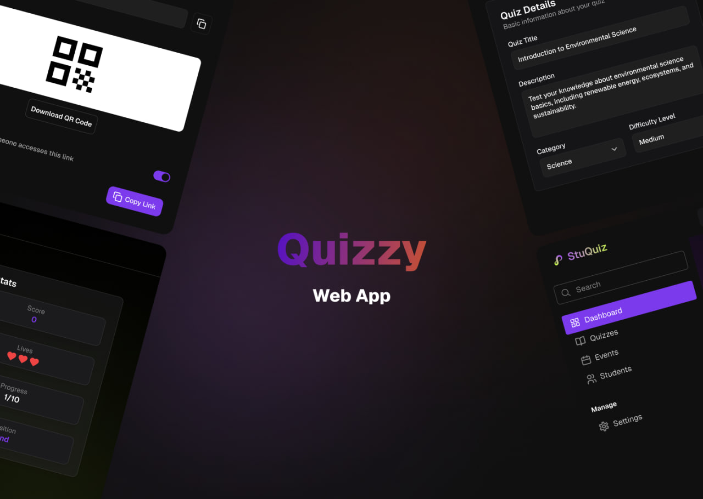
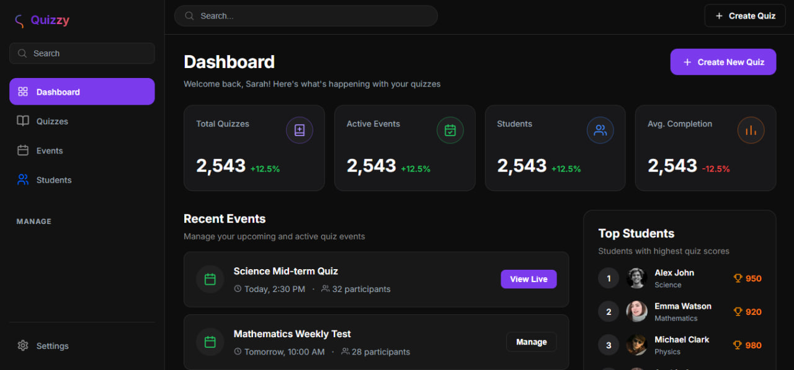

# Quizzy

Quizzy is a front-end-only quiz app shell: landing, sign-in, dashboard, quiz library, detail views, create-quiz flows, share screen with QR, a simple play view, plus students and a full settings area (profile, account, notifications, appearance, privacy, billing). It’s all static HTML and CSS, so there’s nothing to compile. Clone the repo, open `index.html` in a browser, or point any static file server at the project root if you prefer (for example `php -S localhost:8000` from this folder).

The visual design and screen structure are taken from the community Figma file **Quizzy – Modern Web UI**. That file is the reference this UI was built from:

[Quizzy – Modern Web UI (Figma Community)](https://www.figma.com/design/icMszA8qle41HAXxh3afwe/Quizzy-%E2%80%93-Modern-Web-UI--Community-?t=wfKFuRpnm4WiomDK-0)

## Screenshots

Cover / hero preview:

Additional previews:

## Running locally

Because there’s no backend in this repo, you only need to serve the files. Opening `index.html` directly works for many pages; if anything behaves oddly with paths, use a local server from the repository root instead.
